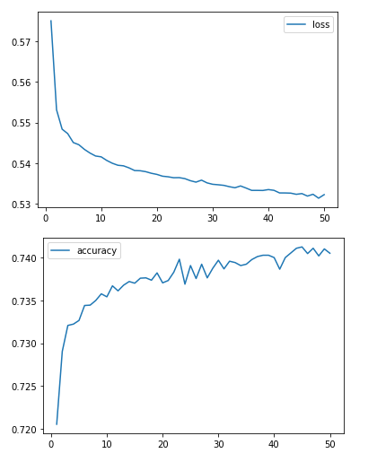
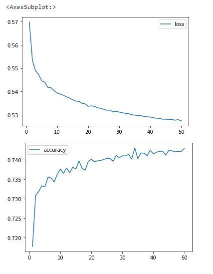
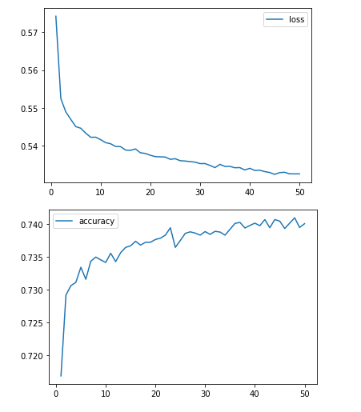
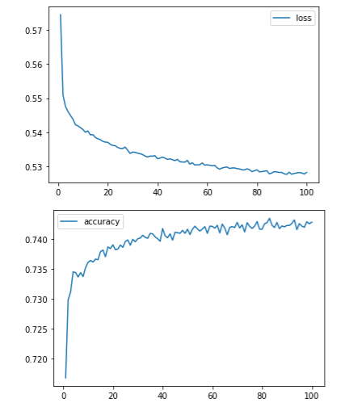
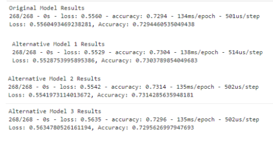

# Venture Funding with Deep Learning

A binary classification model using a deep neural network, which predicts whether Alphabet Soup funding appliants will be successful.

# Analysis

Original model is built using:
* 2 hidden layers
* Layer 1 has 58 nodes
* Layer 2 has 29 nodes
* Both layers use relu as the activation function

<br>



<br>

Alternative model 1 is built using:
* 3 hidden layers
* The number of nodes for the first layer is calculated by taking the mean of the input features and the output layer neurons
* The number of nodes for the second layer is calculated by taking the mean of the first hidden layer nodes and the output layer neurons
* The number of nodes for the third layer is calculated by taking the mean of the second hidden layer nodes and the output layer neurons
* using tanh as the activation function


<br>

Alternative model 2 is built using:
* 2 hidden layers
* The number of nodes in the first layer is 75% of the number of input features
* The number of nodes in the second layer is 25% of the number of input features
* Activation function is relu


<br>

Alternative model 3  is built using:
* Drop the columns - Status and Special Considerations - from the original dataset
* Scale the new Dataframe using Standard Scaler
* Add 3 hidden layers
* The number of nodes for the first layer = 50% of the number of input features
* The number of nodes for the second layer = 30% of the number of input features
* The number of nodes for the third layer = 20% of the number of input features
* using relu as the activation function
* use 100 epochs


<br>

Follwing shows the evaluation of test data using all the four models:


 
---
  ## Technologies

This project uses python 3.7 along with the following packages:

* [JupyterLab](https://jupyterlab.readthedocs.io/en/stable/) - Web based user interface for data analysis.

* [pandas](https://github.com/pandas-dev/pandas) - Data analysis and manipulation library.

* [hvplot](https://pyviz-dev.github.io/hvplot/) - A high-level plotting API for the PyData ecosystem built on HoloViews.

* [sklearn](https://github.com/scikit-learn/scikit-learn) - A Python module for machine learning built on top of SciPy

* [tensorflow](https://www.tensorflow.org/) - A core open source library to help you develop and train ML models.

* [Keras](https://keras.io/) -  A deep learning API
---

## Installation Guide

Please install the following before starting the application

```python
  pip install jupyterlab
  pip install pandas
  pip install hvplot 
  pip install scikit-learn
  pip install --upgrade tensorflow
```
---

## Usage

To use the Venture Funding tool, please download and open the **venture_funding_with_deep_learning.ipynb** in jupyter lab after executing
the following on the command line:

```python
jupyter lab
```
Jupytper Lab should open automatically in a browser. 
If it does not, please follow the instructions on the command line.

---

## Contributors

Abhishika Fatehpuria (abhishika@gmail.com)

---

## License

MIT
